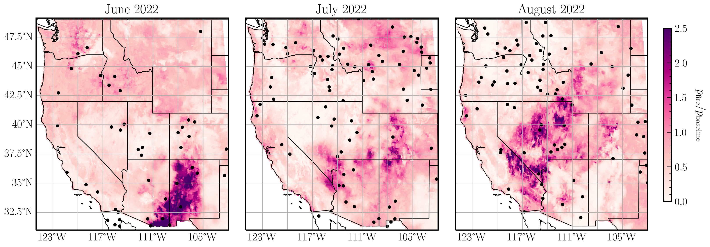

# SEASFire: Seasonal and subseasonal-to-seasonal (S2S) forecasts of fire activity in the western US

In this project, we combine climate forecasts from statistical and dynamical models with antecedent observations, and use a pre-trained [SMLFire1.0](https://github.com/jtbuch/smlfire1.0) framework to produce seasonal fire frequency and burned area forecasts. Schematically, our workflow can be visualized as follows,

A preliminary forecast of fire probability for summer 2022 using observations until May 2022 is shown below:

Future iterations will extend this framework to other fire response variables such as fire intensity and biomass emissions.
