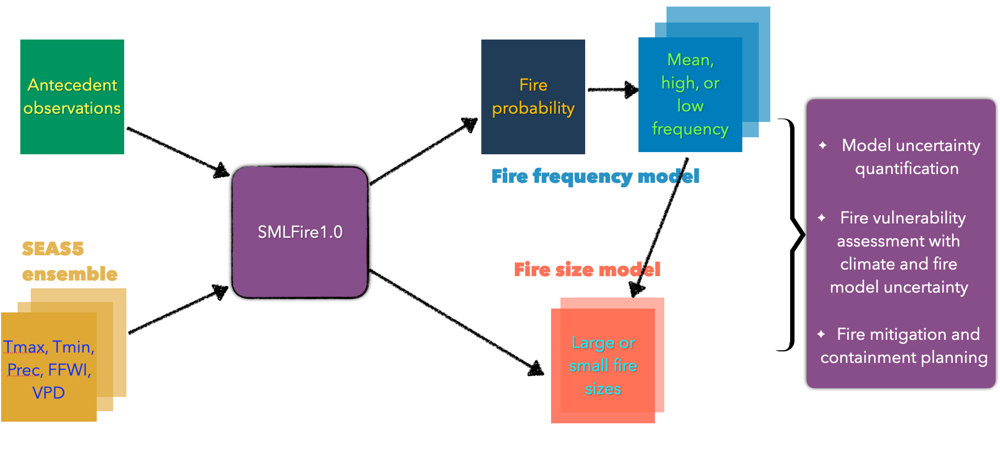

# SEASFire: Seasonal and subseasonal-to-seasonal (S2S) forecasts of fire activity in the western US

In this project, we combine climate forecasts from statistical and dynamical models with antecedent observations, and use a pre-trained [SMLFire1.0](https://github.com/jtbuch/smlfire1.0) framework to produce seasonal fire frequency and burned area forecasts. Schematically, our workflow can be visualized as,

We consider two initialization modes for constructing the input predictors for the SMLFire1.0 framework: i) a single initialization mode where antecedent predictors are derived using observations until the end of April followed by a [SEAS5](https://www.ecmwf.int/en/forecasts/datasets/set-v) forecast initialized at the beginning of May for four primary fire month predictors, and ii) a dual initialization mode where the forecast is intialized at the beginning of April and June, with antecedent predictors caclulated twice using data until the end of April and June respectively. Visually, this may be summarized as,

The architecture of our seasonal fire forecasting system allow us to generate fire probability maps in each 12km x 12km grid cell across the study region. A preliminary forecast of fire probability for summer 2023 using observations until May 2023 is shown below,

Future iterations will extend this framework to other fire response variables such as fire intensity and biomass emissions.

Code requirements:
* python=3.9.13
* cfgrib=0.9.10.4
* xesmf=0.7.1
* tensorflow=2.13.0
* tensorflow-probability=0.21.0
* scipy=1.11.1
* numpy=1.24.3
* xarray (version agnostic)
* geopandas (version agnostic)

Use the [package-list.txt](https://github.com/jtbuch/SEASFire/blob/master/package-list.txt) file to set up a compatible conda environment for execution.

